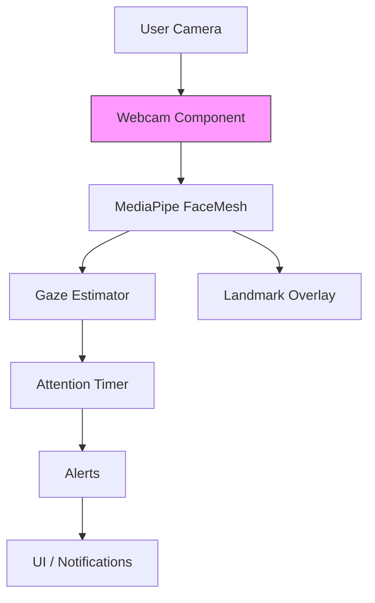

# Flowchart

The system flow is illustrated below (Mermaid). Save as PDF or render in a compatible viewer.

```mermaid
flowchart TD
  A[User Camera] --> B[Webcam Component]
  B --> C[MediaPipe FaceMesh]
  C --> D[Gaze Estimator]
  D --> E[Attention Timer]
  E --> F[Alerts]
  F --> G[UI / Notifications]
  C --> H[Landmark Overlay]
  style B fill:#f9f,stroke:#333,stroke-width:1px
```

Usage: render this file with a Markdown viewer that supports Mermaid.
